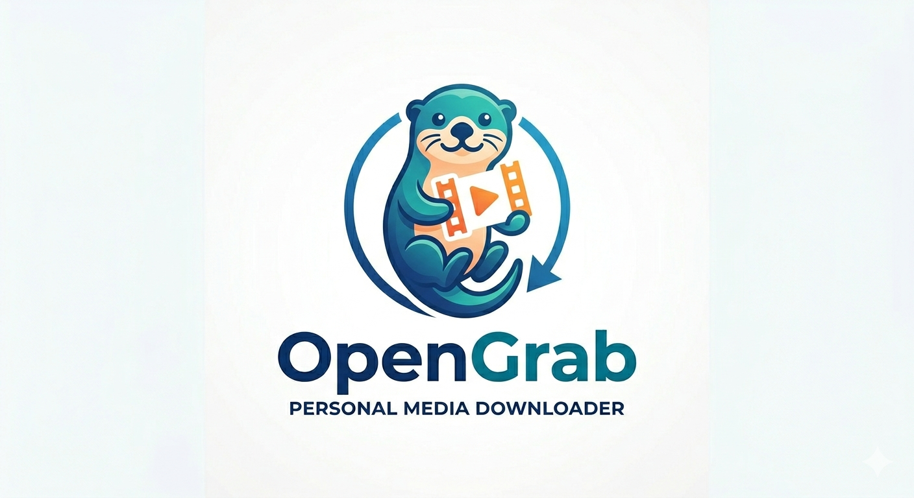

<div align="center">

  <a href="https://github.com/Skydope/OpenGrab">
    <picture>
      <source media="(prefers-color-scheme: dark)" srcset="Logo-dark.png">
      <source media="(prefers-color-scheme: light)" srcset="Logo.png">
      
    </picture>
  </a>

  > Self-hosted video & audio downloader — paste a URL from any site, get an MP4. Wraps yt-dlp (1800+ sites) + ffmpeg behind a clean web UI.

  [](LICENSE)
  []()
  [](https://python.org)
  [](https://hub.docker.com)

  [**English**](#) · [**Español**](#español)

</div>

> [!CAUTION]
> **OpenGrab is a self-hosted tool for personal use.** The authors are not
> responsible for how you use it. You are solely responsible for complying
> with the Terms of Service of the platforms you interact with and applicable
> copyright laws. Use only with content you own, is licensed for reuse, or
> under fair use provisions.

<details>
<summary>Ver en Español</summary>

> **OpenGrab** — Descargador de YouTube auto-alojado. Pegás una URL, te llevás un MP4 (o MP3). Envoltorio web de yt-dlp + ffmpeg.
>
> Instalación rápida, ejemplos y guía de contribución disponibles más abajo en inglés. Podés abrir issues en español sin problema.

</details>

---

## Table of Contents

- [Overview](#overview)
- [Features](#features)
- [Tech Stack](#tech-stack)
- [Getting Started](#getting-started)
- [Desktop App](#desktop-app)
- [Usage](#usage)
- [Architecture](#architecture)
- [Environment Variables](#environment-variables)
- [API Reference](#api-reference)
- [Nginx (TLS)](#nginx-tls)
- [Contributing](#contributing)
- [License](#license)

---

## Overview

OpenGrab is a self-hosted video & audio downloader for your homelab or LAN. Paste a URL from practically any site — YouTube, Vimeo, TikTok, Instagram, X/Twitter, Bandcamp, SoundCloud, and thousands more — choose a quality preset, and get back an MP4 or MP3 file. No browser extensions, no shady websites. Just your own server — or a [Windows desktop app](#desktop-app-windows) if you prefer.

Built on top of [yt-dlp](https://github.com/yt-dlp/yt-dlp) (engine that supports 1800+ sites) and [ffmpeg](https://ffmpeg.org/) for muxing. The entire backend is a single FastAPI app with an inline vanilla frontend — zero npm, zero bundlers, zero CDN calls.

---

## Features

- Video downloads as **MP4** (best, 1080p, 720p, 480p) or **MP3** (audio-only)
- **Universal support** — works with any site yt-dlp can handle (1800+), not just YouTube
- **Playlist support** — browse all videos in a playlist and download selected ones in batch
- Real-time progress via **Server-Sent Events** (SSE), no WebSocket complexity
- **Download history** persisted to SQLite (WAL mode), with crash recovery
- Optional **token authentication** to restrict access (`OPENGRAB_TOKEN`)
- **Human-friendly error messages** with a retry button for failed downloads
- **yt-dlp hot-swap** — update the download engine from the UI or on desktop start, without rebuilding
- Configurable limits: max concurrent jobs, max file size, total disk budget
- **Pinned yt-dlp** in the image for reproducible builds; kept fresh via Dependabot. Optional opt-in auto-update on container start (`OPENGRAB_AUTOUPDATE=1`) for when you need the latest fix immediately
- Production-ready **nginx reverse proxy** config with TLS, SSE-friendly settings, and security headers
- **Windows desktop app** — native window via pywebview + WebView2, system tray, single-instance, installer wizard (Spanish/English)

---

## Tech Stack

| Layer | Technology | Notes |
|-------|-----------|-------|
| Runtime | Python 3.11+ | — |
| Web framework | FastAPI + uvicorn | Async, type-driven |
| Download engine | yt-dlp | Runs in thread pool (blocking I/O) |
| Video processing | ffmpeg | System binary, muxing to MP4 |
| Data | SQLite (WAL mode) | Job persistence, crash recovery, history |
| Frontend | Alpine.js + vanilla CSS | Embedded, no CDN, dark/light theme |
| Container | Docker + Compose | Single-image, healthcheck included |
| Reverse proxy | nginx | Optional, with TLS and SSE support |
| Desktop | pywebview + pystray | Windows app, system tray, WebView2 |

---

## Getting Started

### Manual Setup

Prefer to configure things yourself? Here's the direct approach.

**Prerequisites**

- **Docker** >= 24.x (recommended) — or —
- **Python** 3.11+ with `pip`
- **ffmpeg** on PATH (included in the Docker image; on bare metal: `apt install ffmpeg`, `brew install ffmpeg`, or `pacman -S ffmpeg`)

```bash
git clone https://github.com/skydope/opengrab.git
cd opengrab

# Copy and configure environment
cp .env.example .env
# Edit .env if you want to set a token or change defaults

# Start with Docker Compose
docker compose up -d
# http://localhost:8800
```

> [!TIP]
> For bare-metal usage (no Docker), run `pip install -r requirements.txt` and then `python app.py`. Make sure ffmpeg is on your PATH.

---

## Desktop App

| Platform | Download | Format |
|----------|----------|--------|
| Windows | `OpenGrab-Setup.exe` | Installer wizard (Spanish/English) |
| Linux | `OpenGrab-x86_64.AppImage` | Portable executable |
| macOS | `OpenGrab-macos.zip` | App bundle |

All downloads include bundled ffmpeg and yt-dlp with hot-swap support.

Download from the [latest release](https://github.com/Skydope/OpenGrab/releases/latest).

### Platform notes

**Windows:** Installer wizard with Recommended (defaults) and Advanced (custom folder, port,
password, auto-start) modes. Native window via WebView2 (pywebview), silently installed if
missing. System tray support.

**Linux:** AppImage — `chmod +x OpenGrab-x86_64.AppImage && ./OpenGrab-x86_64.AppImage`.
Opens your default browser (no native window). System tray via D-Bus/pystray. Requires a
desktop environment with an indicator area (GNOME, KDE, XFCE, etc.).

**macOS:** Unzip and run `OpenGrab.app`. Native window via Cocoa WebKit (pywebview). System
tray support. May require right-click → Open on first launch (Gatekeeper).

---

## Usage

1. Open `http://localhost:8800` in your browser
2. If you set `OPENGRAB_TOKEN`, enter the token when prompted (stored in an HTTP-only cookie, 30-day expiry)
3. Paste a URL from any supported site and click **Analizar**
4. Choose a quality preset: `best mp4`, `1080p`, `720p`, `480p`, or `solo audio · mp3`
5. Click **Descargar** — progress appears in the terminal-style output area
6. When complete, click the download link to save the file

For playlists, step 3 will detect the URL and show the playlist panel. Select the videos you want and click **Descargar playlist**.

---

## Architecture

```
opengrab/
├── app.py              # Entrypoint (~120 lines)
├── config.py           # Environment + config.ini
├── state.py            # AppState — runtime jobs, events, eviction
├── db.py               # SQLite data layer (WAL, crash recovery)
├── models.py           # Pydantic models
├── download.py         # yt-dlp wrappers + error mapping
├── routes.py           # API endpoints (APIRouter, 13 endpoints)
├── desktop.py          # Windows desktop launcher (pywebview)
├── engine_update.py    # yt-dlp hot-swap via PyPI wheel
├── static/
│   ├── index.html      # Alpine.js SPA
│   ├── style.css       # Dark/light theme, WCAG AA
│   └── alpine.min.js   # Embedded (~43KB), no CDN
├── tests/              # pytest tests (~111 tests)
├── vendor/             # Bundled ffmpeg + app icon
├── nginx/              # Reverse proxy TLS config
├── Dockerfile          # Non-root user, healthcheck
├── docker-compose.yml
├── OpenGrab.spec       # PyInstaller build spec
└── opengrab.iss        # Inno Setup installer wizard
```

**Key design decisions:**
- **Async backend + thread pool.** FastAPI handles HTTP, yt-dlp runs in `asyncio.to_thread()` to avoid blocking the event loop.
- **SSE over WebSockets.** Progress updates use `asyncio.Event` with a 2-second timeout polling loop. Simpler than WebSockets, zero extra dependencies.
- **RAM + SQLite state.** Job state (progress, speed, ETA) lives in-memory for real-time SSE delivery. State transitions (queued → downloading → done) are persisted to SQLite (WAL mode). History reads come from the database. Old in-memory jobs are evicted after 1 hour.
- **Offline-first frontend.** Alpine.js is embedded (~43KB), CSS uses variables for theming. No CDN calls, works entirely on LAN.

---

## Environment Variables

| Variable | Required | Default | Description |
|----------|----------|---------|-------------|
| `OPENGRAB_HOST` | No | `127.0.0.1` | Bind address (`0.0.0.0` for Docker) |
| `OPENGRAB_PORT` | No | `8800` | HTTP server port |
| `OPENGRAB_DIR` | No | `./downloads` | Output directory for downloaded files |
| `OPENGRAB_TOKEN` | No | — | If set, requires Bearer token on all `/api/*` routes. If empty, auto-generates one at startup. |
| `OPENGRAB_NO_AUTH` | No | — | Set to `1` to disable authentication (dev/local only) |
| `OPENGRAB_MAX_JOBS` | No | `2` | Maximum concurrent downloads |
| `OPENGRAB_MAX_SIZE_MB` | No | `0` (unlimited) | Per-file size limit |
| `OPENGRAB_MAX_TOTAL_MB` | No | `0` (unlimited) | Disk budget — refuses new jobs via HTTP 507 when exceeded |
| `OPENGRAB_AUTOUPDATE` | No | `0` | Auto-update yt-dlp on container start. Opt-in. |
| `OPENGRAB_YTDLP_VERSION` | No | — | Pin a specific yt-dlp version when auto-update is enabled |
| `OPENGRAB_TRUST_XFF` | No | `0` | Trust `X-Forwarded-For` for rate limiting (enable behind nginx) |
| `OPENGRAB_CONFIG` | No | — | Custom path to `config.ini` (desktop mode) |

See [`.env.example`](.env.example) for a ready-to-copy template.

---

## API Reference

All `/api/*` endpoints require authentication unless `OPENGRAB_NO_AUTH=1`. If `OPENGRAB_TOKEN` is empty, a token is auto-generated at startup and printed to the logs. Authenticate via:
- `Authorization: Bearer <token>` header
- `?token=<token>` query parameter
- `opengrab_token` HTTP-only cookie (set by `POST /api/auth`, 30-day expiry)

| Method | Path | Rate Limit | Description |
|--------|------|------------|-------------|
| `GET` | `/` | — | Web UI |
| `GET` | `/health` | — | Health check (returns `{"status":"ok"}`) |
| `POST` | `/api/auth` | — | Authenticate and receive cookie — body: `{"token":"..."}` |
| `POST` | `/api/logout` | — | Clear auth cookie |
| `GET` | `/api/info?url=...` | 10/min | Fetch video metadata + available formats |
| `GET` | `/api/playlist?url=...` | 10/min | Fetch playlist entries |
| `POST` | `/api/jobs` | 5/min | Create download job — body: `{"url":"...", "quality":"best"}` |
| `GET` | `/api/jobs/{id}/events` | — | SSE progress stream for a job |
| `GET` | `/api/jobs/{id}/file` | — | Download the completed file |
| `POST` | `/api/jobs/{id}/open-folder` | — | Open file explorer to downloaded file |
| `POST` | `/api/engine/update` | 2/min | Force yt-dlp hot-swap |
| `GET` | `/api/history?limit=20` | — | Download history as JSON |

### `POST /api/jobs`

**Request body:**
```json
{
  "url": "https://www.youtube.com/watch?v=...",
  "quality": "best"
}
```

`quality` must be one of: `best`, `1080p`, `720p`, `480p`, `audio`.

**Response:**
```json
{"job_id": "a1b2c3d4e5f6"}
```

### `GET /api/jobs/{id}/events`

SSE stream. Each event is a JSON snapshot:
```json
{"status":"downloading","percent":45.3,"speed":"12.3MiB/s","eta":"00:42","note":"","filename":"","error":""}
```

On completion: `"status": "done"` with `"filename"` set.
On error: `"status": "error"` with `"error"` containing the message.

---

## Nginx (TLS)

A production-ready nginx config is included at `nginx/opengrab.conf`. Drop it into your nginx `conf.d/` directory. It handles:

- HTTP → HTTPS redirect
- TLS termination (point `ssl_certificate` to your certificate)
- SSE-friendly settings (`proxy_buffering off`, 3600s timeouts)
- Security headers (HSTS, X-Frame-Options, X-Content-Type-Options)
- Docker DNS resolver so nginx starts even if opengrab is momentarily down

---

## Contributing

Contributions are welcome. Please follow these steps:

1. Fork the repository
2. Create a feature branch (`git checkout -b feat/your-feature`)
3. Commit your changes following [Conventional Commits](https://www.conventionalcommits.org/)
4. Push and open a Pull Request

> [!NOTE]
> Issues and PRs in Spanish are welcome / Los issues y PRs en español son bienvenidos.

---

## License

Distributed under the [MIT License](LICENSE). See `LICENSE` for details.

---

## Español

> **OpenGrab** — Descargador de video auto-alojado. Pegás una URL de cualquier sitio, te llevás un MP4 (o MP3).

### Descripción general

OpenGrab es un descargador de video y audio que corrés en tu propio servidor. Pegás una URL de prácticamente cualquier sitio — YouTube, Vimeo, TikTok, Instagram, X/Twitter, Bandcamp, SoundCloud, y miles más — elegís calidad, y te descarga un MP4 o MP3. Nada de extensiones de navegador, sitios shady. Solo tu servidor — o la [app de escritorio para Windows](#desktop-app-windows) si preferís.

Usa [yt-dlp](https://github.com/yt-dlp/yt-dlp) (motor que soporta +1800 sitios) y [ffmpeg](https://ffmpeg.org/) para el muxing. Todo el backend es una app FastAPI con frontend vanilla inline — sin npm, sin bundlers, sin CDN.

### Instalacion manual

Si preferis configurar todo vos, este es el camino directo.

**Requisitos previos**

- **Docker** >= 24.x (recomendado) — o —
- **Python** 3.11+ con `pip`
- **ffmpeg** en el PATH (incluido en la imagen Docker; en bare metal: `apt install ffmpeg`, `brew install ffmpeg`, o `pacman -S ffmpeg`)

```bash
git clone https://github.com/skydope/opengrab.git
cd opengrab
cp .env.example .env
docker compose up -d
# → http://localhost:8800
```

> [!TIP]
> Para bare metal (sin Docker), corre `pip install -r requirements.txt` y despues `python app.py`. Asegurate de tener ffmpeg en el PATH.

### Uso básico

1. Abrí `http://localhost:8800`
2. Pegá una URL y clic en **Analizar**
3. Elegí calidad (best, 1080p, 720p, 480p, o solo audio mp3)
4. Clic en **Descargar**

### Contribuir

Las contribuciones son bienvenidas. Podés abrir issues o PRs en español. Seguí los pasos de la sección [Contributing](#contributing) más arriba.

### Licencia

Distribuido bajo la [Licencia MIT](LICENSE).

> [!CAUTION]
> **OpenGrab es una herramienta auto-alojada para uso personal.** Los autores
> no se hacen responsables del uso que le des. Es tu responsabilidad cumplir
> con los Términos de Servicio de las plataformas y las leyes de copyright
> aplicables. Usalo solo con contenido propio, con licencia que lo permita,
> o bajo fair use.
